<div align="center">

# 🤖 Marketing Agent AI

### Autonomous Marketing Intelligence Agent

*An agentic AI system that independently perceives, reasons, plans, and executes brand marketing strategies*

[](#)
[](https://deepmind.google/technologies/gemini/)
[](https://firebase.google.com/)
[](https://www.typescriptlang.org/)

</div>

---

## 🤖 What is Agentic AI?

**Agentic AI** refers to autonomous systems that can independently perceive their environment, reason about goals, plan actions, and execute tasks with minimal human intervention. Unlike simple AI APIs, **agents act autonomously across multi-step workflows**.

This project implements a **fully autonomous marketing agent** that:
- 🔍 **Perceives** — Crawls and observes websites, downloads images, extracts content
- 🧠 **Reasons** — Analyzes brand identity, understands context, identifies patterns  
- 📋 **Plans** — Develops marketing strategies, selects creative approaches
- ⚡ **Acts** — Generates images, writes copy, creates complete campaigns

**Zero human intervention required between input (URL) and output (ready-to-post campaigns).**

---

## 🎯 The Problem I Solved

**Businesses struggle with consistent, on-brand marketing.** They lack the resources to hire agencies or dedicated marketing teams, leading to:
- Inconsistent brand messaging across channels
- Time-consuming content creation
- Generic, cookie-cutter marketing campaigns
- Difficulty maintaining brand identity at scale

## 💡 My Solution: An Autonomous Marketing Agent

I built an **agentic AI system** that autonomously handles the entire marketing workflow. Give it a URL, and the agent:

1. **🔍 PERCEIVES** — Crawls up to 30 pages, downloads images, gathers all brand signals
2. **🧠 REASONS** — Analyzes visual + textual content to extract Brand DNA
3. **📋 PLANS** — Develops marketing strategy aligned with brand identity
4. **⚡ ACTS** — Generates campaigns with AI images, copy, and scheduling recommendations

<div align="center">

### 🎥 Watch the Agent in Action
*(Add your demo video/GIF here)*

[](https://www.youtube.com/watch?v=YOUR_VIDEO_ID)

*Click to watch the full demo*

</div>

---

## ✨ Core Features

### 1. 🧬 Brand DNA Extraction
- Crawls up to 30 pages per website
- Downloads and analyzes up to 10 key images with vision AI
- Extracts: colors, fonts, tone of voice, core messaging, target audience
- Identifies business-specific insights dynamically
- Returns actual website images for visual reference

### 2. 🎨 AI Campaign Generation
- Multiple creative modes: *On-Brand Classic*, *Trending & Bold*, *Storytelling Focus*
- Generates complete post ideas with:
  - Custom image prompts → Imagen 4 generated visuals
  - Headlines and body copy
  - Platform-optimized captions
  - Relevant hashtags
- Built-in fact verification against Brand DNA

### 3. 🔄 Image Remix Studio
- Upload any image + logo
- AI analyzes optimal enhancement strategy
- Gemini 2.5 Flash Image applies creative edits
- Smart logo placement with dynamic positioning
- Caption and hashtag generation

### 4. 📅 Content Calendar
- Schedule generated posts
- Visual timeline view
- Drag-and-drop organization

---

## 🏗️ Agentic Architecture

### The Agent Workflow

```mermaid
flowchart LR
    subgraph INPUT["� Input"]
        URL["Website URL"]
    end
    
    subgraph PERCEIVE["🔍 PERCEIVE"]
        CRAWL["Multi-Page Crawler"]
        IMG_DL["Image Downloader"]
        PARSE["Content Parser"]
    end
    
    subgraph REASON["🧠 REASON"]
        VISION["Multimodal Vision Analysis"]
        EXTRACT["Brand DNA Extraction"]
        PATTERN["Pattern Recognition"]
    end
    
    subgraph PLAN["📋 PLAN"]
        STRATEGY["Marketing Strategy"]
        CREATIVE["Creative Direction"]
        PROMPTS["Image Prompt Engineering"]
    end
    
    subgraph ACT["⚡ ACT"]
        IMAGEN["AI Image Generation"]
        COPY["Copywriting"]
        SCHEDULE["Campaign Assembly"]
    end
    
    subgraph OUTPUT["📤 Output"]
        CAMPAIGNS["Ready-to-Post<br/>Campaigns"]
    end

    URL --> CRAWL
    CRAWL --> IMG_DL --> PARSE
    PARSE --> VISION --> EXTRACT --> PATTERN
    PATTERN --> STRATEGY --> CREATIVE --> PROMPTS
    PROMPTS --> IMAGEN --> COPY --> SCHEDULE
    SCHEDULE --> CAMPAIGNS
    
    %% Styling for agentic phases
    style PERCEIVE fill:#3b82f6,color:#fff
    style REASON fill:#8b5cf6,color:#fff
    style PLAN fill:#f59e0b,color:#fff
    style ACT fill:#10b981,color:#fff
```



### Why This is Truly Agentic

| Traditional AI API | This Agentic System |
|-------------------|---------------------|
| Single request → Single response | Autonomous multi-step workflow |
| Requires human orchestration | Self-orchestrating pipeline |
| Static input format | Dynamic environment perception |
| No planning capability | Strategic reasoning before action |
| Isolated tasks | Coherent goal-directed behavior |

### Agentic Capabilities Deep Dive

| Agent Phase | What It Does Autonomously | Technologies |
|------------|---------------------------|--------------|
| **🔍 Perceive** | Discovers and crawls up to 30 pages, downloads 10+ images, parses HTML structure, identifies logos and hero images | Cheerio, Axios, URL parsing |
| **🧠 Reason** | Analyzes images with vision AI, extracts colors/fonts/tone, identifies business type, builds structured Brand DNA | Gemini 3 Flash Multimodal |
| **📋 Plan** | Selects creative mode, develops campaign angles, engineers image prompts based on brand identity | Gemini 3 Flash |
| **⚡ Act** | Generates images, writes platform-specific copy, creates hashtags, assembles complete campaigns | Imagen 4, Gemini 3 Flash |

### Key Technical Decisions

| Challenge | Solution | Why This Approach |
|-----------|----------|-------------------|
| **Extracting accurate brand data** | Multi-page website crawling + Vision AI analysis on actual images | Web grounding alone caused hallucinations; direct content analysis is more reliable |
| **Handling diverse business types** | Dynamic `insights` schema that adapts per business | Rigid schemas failed for non-restaurant businesses |
| **Token limit management** | Strip base64 image data before sending to LLM for campaign generation | Prevents 400 errors on large Brand DNA objects |
| **Rate limiting on image generation** | Exponential backoff retry logic (2s, 4s, 8s) | Imagen 4 has aggressive rate limits |
| **SDK migration** | Custom wrapper class mimicking old SDK patterns | Migrated from deprecated `@google-cloud/vertexai` to `@google/genai` without refactoring all call sites |

---


## 🛠️ Technology Stack

### Frontend
- **React 19** with functional components and hooks
- **TypeScript** for type safety
- **Vite** for blazing fast development
- **CSS-in-JS** with custom design system

### Backend (Serverless)
- **Firebase Cloud Functions** (Node.js 22)
- **Firebase Authentication** (future integration ready)
- **Cheerio** for HTML parsing
- **Axios** for HTTP requests with timeout handling

### AI/ML
| Model | Purpose | Provider |
|-------|---------|----------|
| `gemini-3-flash-preview` | Brand analysis, campaign strategy, copy generation | Vertex AI |
| `gemini-2.5-flash-image` | Image editing and enhancement | Vertex AI |
| `imagen-4.0-generate-001` | AI image generation from prompts | Vertex AI |

### DevOps
- Vitest for testing
- Firebase Hosting for deployment
- Vertex AI service account authentication

---

## 📊 Value Delivered

| Metric | Impact |
|--------|--------|
| **Time to Brand Analysis** | ~30 seconds vs. hours of manual research |
| **Content Generation** | 2 complete campaigns with images in under 2 minutes |
| **Brand Consistency** | AI-enforced adherence to extracted Brand DNA |
| **Cost Efficiency** | Serverless architecture scales from 0 to thousands of requests |

---

## 🔍 What Makes This Project Stand Out

### 1. **True Agentic AI Architecture**
This isn't just an AI API wrapper—it's an **autonomous agent** with:
- **Perception Layer** — Independently crawls and observes the web environment
- **Reasoning Engine** — Multimodal analysis combining vision + NLP
- **Planning Module** — Strategic decision-making for campaign direction
- **Action Executor** — Generates tangible outputs (images, copy, campaigns)
- **Zero human intervention** between input and final deliverables

### 2. **Multi-Model Orchestration**
The agent coordinates **three different AI models** in a single workflow:
```
Gemini 3 Flash (reasoning) → Imagen 4 (generation) → Gemini 2.5 Flash Image (editing)
```

### 3. **Production-Grade Reliability**
Not a prototype—this is built for real-world use:
- Exponential backoff retry logic for rate limits
- Token limit management to prevent API failures
- Graceful degradation when services are unavailable
- SDK abstraction layers for maintainability

### 4. **Business-Aware Intelligence**
The agent **adapts** to any business type:
- Dynamically identifies relevant brand attributes
- Fact-verification prevents hallucinations
- Content grounded in actual website data, not assumptions

---

## 📁 Project Structure

```
brand-genius-ai-agent/
├── components/           # React UI components
│   ├── BrandInputForm    # URL input and analysis trigger
│   ├── ResultsDisplay    # Brand DNA visualization
│   ├── CampaignGenerator # AI campaign studio
│   ├── CampaignCard      # Individual post cards with regeneration
│   ├── ImageRemix        # Image enhancement workflow
│   └── ContentCalendar   # Scheduling interface
├── services/             # Client-side services
│   ├── firebase.ts       # Firebase initialization
│   ├── geminiService.ts  # API call handlers
│   └── usageTracker.ts   # Analytics
├── functions/            # Firebase Cloud Functions
│   └── src/index.ts      # All serverless AI functions
├── types.ts              # TypeScript interfaces
└── App.tsx               # Main application shell
```

---

## 🎓 Skills Demonstrated

- **🤖 Agentic AI Development** — Autonomous agent design, multi-step workflows, Perceive-Reason-Plan-Act patterns
- **🧠 LLM Engineering** — Prompt engineering, multimodal AI, vision models, multi-model orchestration
- **☁️ Cloud AI Integration** — Vertex AI, Gemini API, Imagen API, service account auth
- **🔧 Full-Stack Development** — React 19, TypeScript, Node.js, Firebase Cloud Functions
- **🕷️ Web Intelligence** — Autonomous crawling, content extraction, image analysis
- **⚡ Production Systems** — Error handling, retry logic, rate limiting, graceful degradation

---

## 👤 About the Developer

I build **agentic AI systems** that solve real business problems autonomously. This project demonstrates my ability to:

- Design and implement **autonomous AI agents** with multi-step reasoning
- Orchestrate **multiple AI models** in cohesive workflows  
- Ship **production-grade** applications with proper error handling
- Take projects from **concept to deployed solution**

**Looking to add agentic AI capabilities to your team?** Let's connect!

---

<div align="center">

### 🤖 This is Agentic AI in Action

*One URL in → Complete marketing campaigns out*

*No human orchestration required*

---

*This repository showcases architecture and capabilities. Source code available for serious inquiries.*

**Built with autonomous AI 🤖**

</div>
